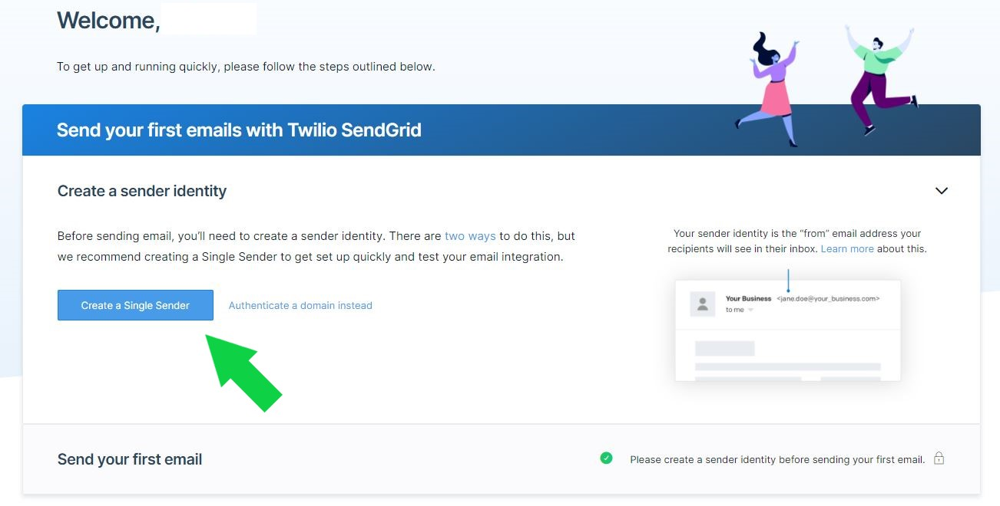
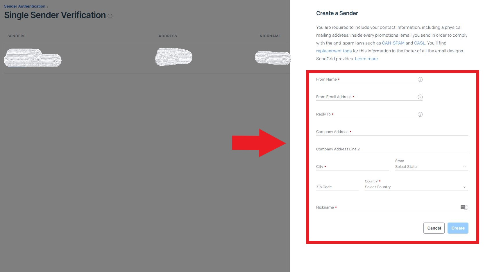
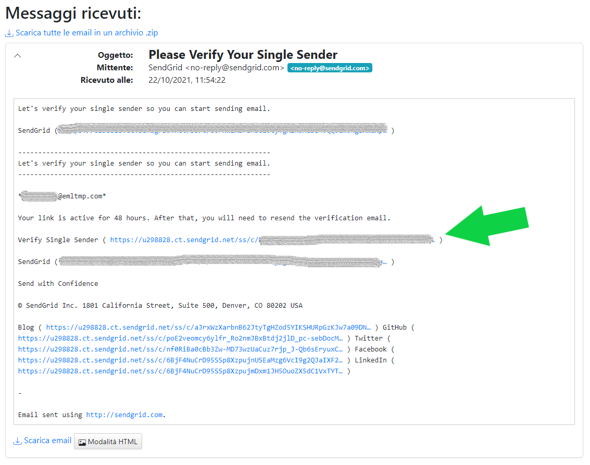
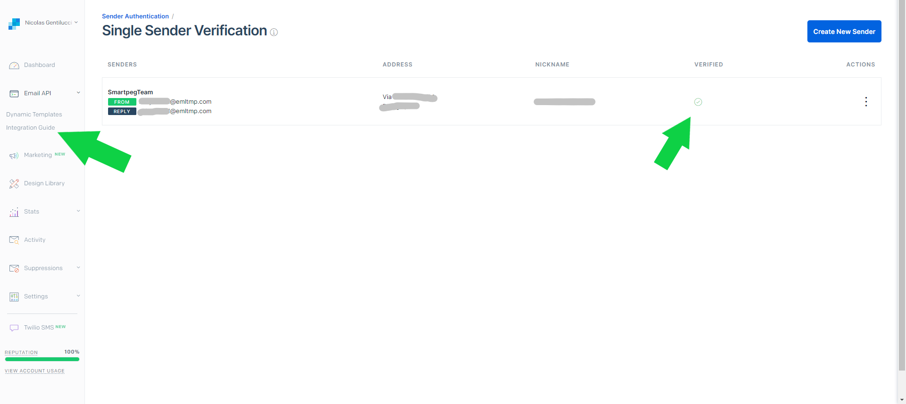
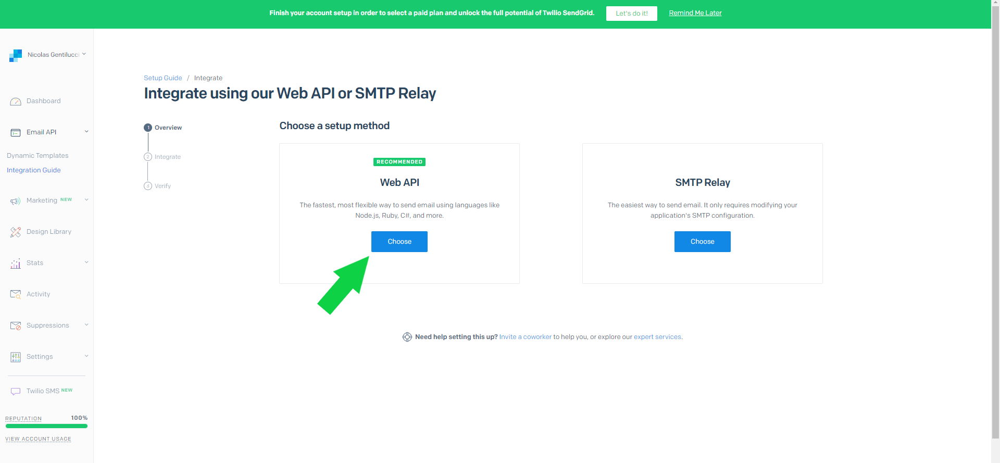
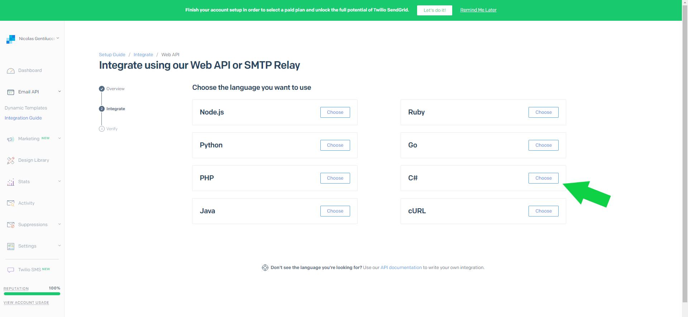
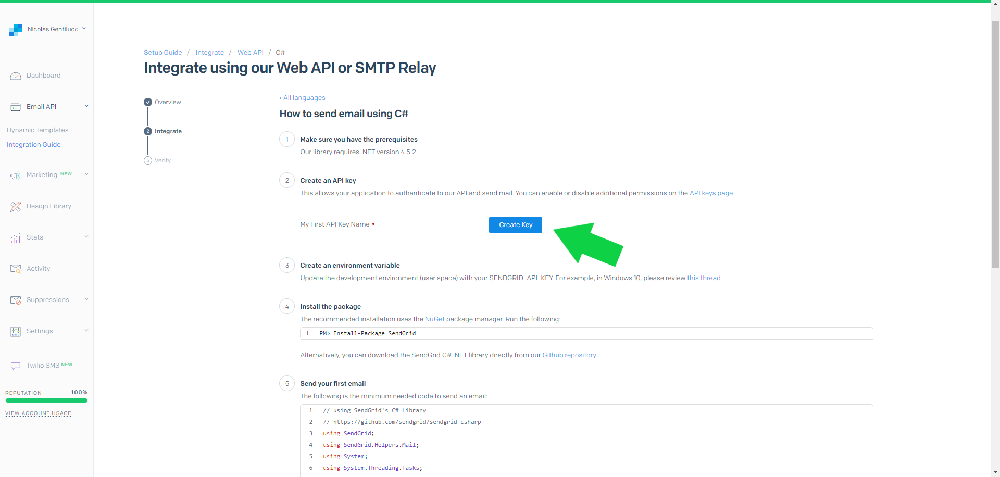
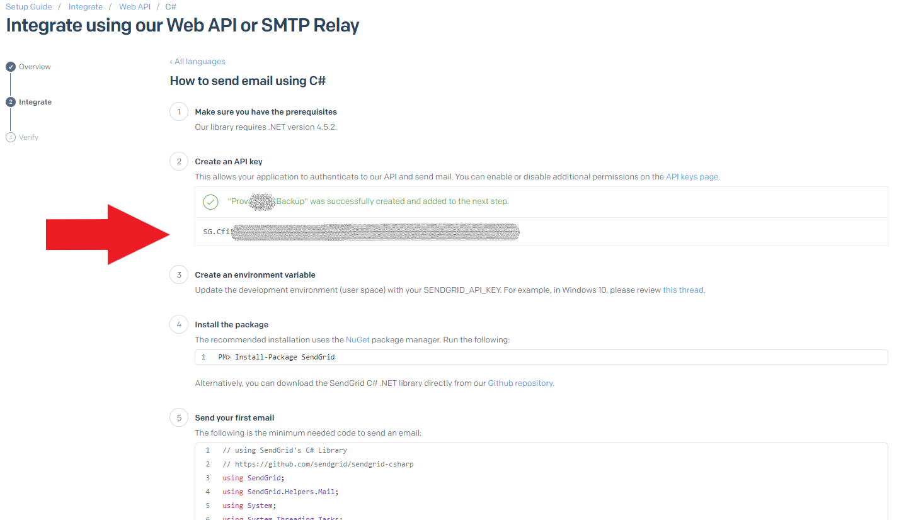
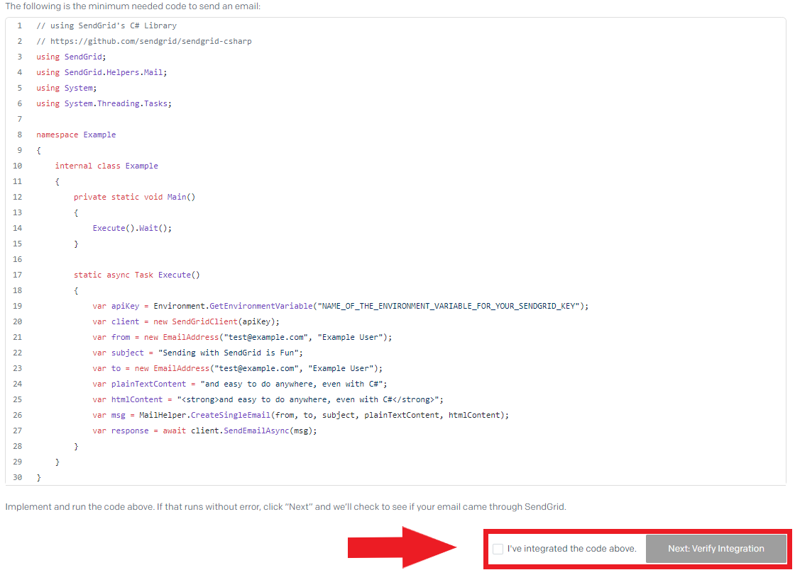

# SendGrid Configuration

1. Setup for Email Sender

- 1.1 Login here [SendGrid Login](https://app.sendgrid.com/login) and insert your username + password:

- 1.2 or Create an account from [SendGrid SignUp](https://signup.sendgrid.com/)

- 1.3 Login and Create a Single Sender:

- 1.4 Set the request parameters:

- 1.5 Click the link and verificate your Sender:

- 1.6 Return on your browser. Now you have the sender verificated! Then click drop-down-menu **Email API** and go to **Integration Guide**:

- 1.7 Click on **Choose Web API**:

- 1.8 Click on C# **Choose**:

- 1.9 Choose your **Key Name** (whatever you like) and click **Create Key**:

- 1.10 Now copy the key on your file configuration:
  **PAY ATTENTION** Copy this key now, beacause it's impossible to recover later:

**Example:**

- 1.11 Click on checkbox and press **Next: Verify Integration**:

- ✅ Now you have set the Email Sender Profile! ✅
